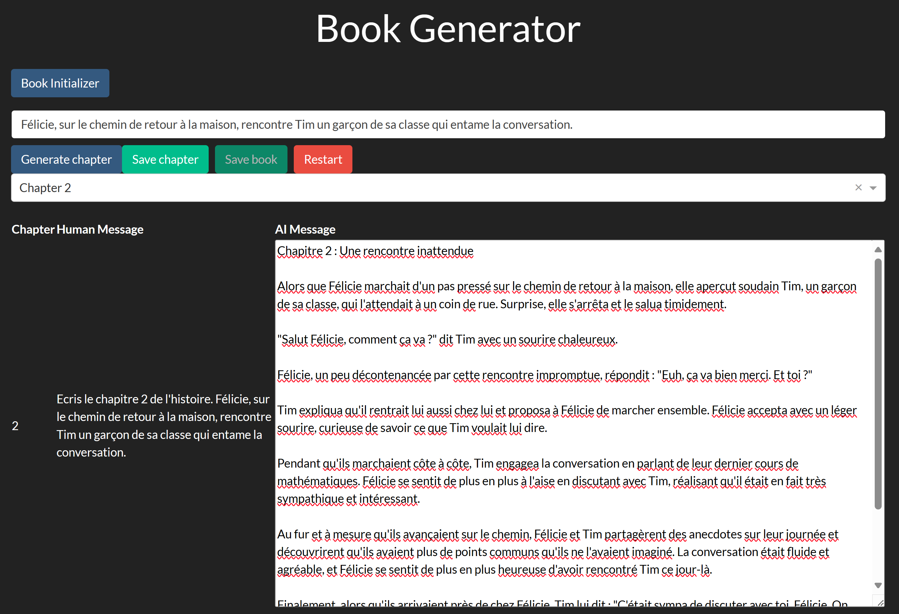

# bookjibe
Generate books with AI power.



# Installation 

Clone the repo. 

```bash
git clone https://github.com/jpoullet2000/bookjibe.git
```

```bash
pip install poetry 
poetry install 
```

Create a .env file in the root folder with the content:

```
BOOKJIBE_PROMPT_FOLDER=init_prompts/french
BOOKJIBE_USER_LANGUAGE=fr
BOOKJIBE_TEMPORARY_FOLDER=<tmp_folder>
OPENAI_API_KEY=<openai_key>
OPENAI_MODEL=gpt-3.5-turbo
```

Note that `BOOKJIBE_PROMPT_FOLDER` can refer a different folder (not limited to french prompts). The bookjibe user language can also be a different language, e.g., `en`. 